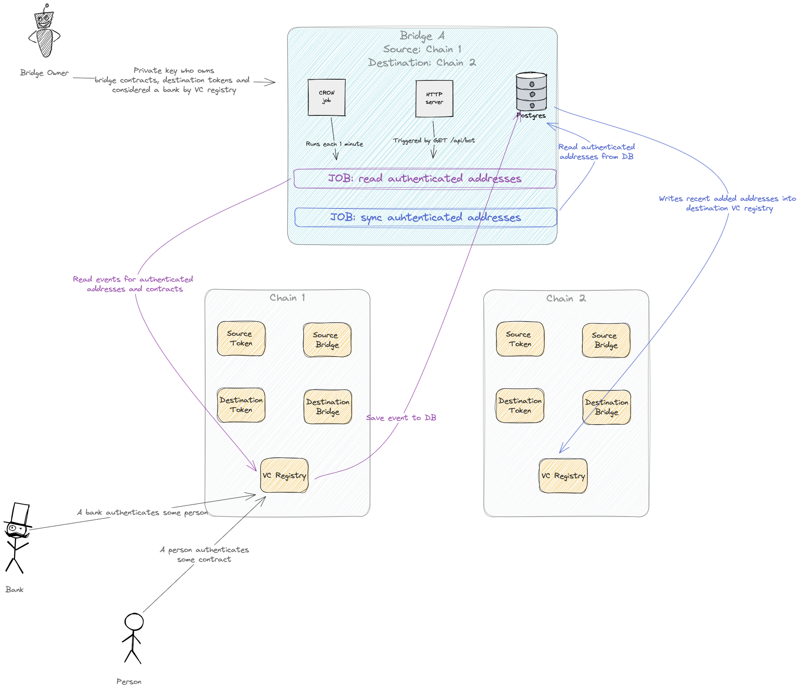
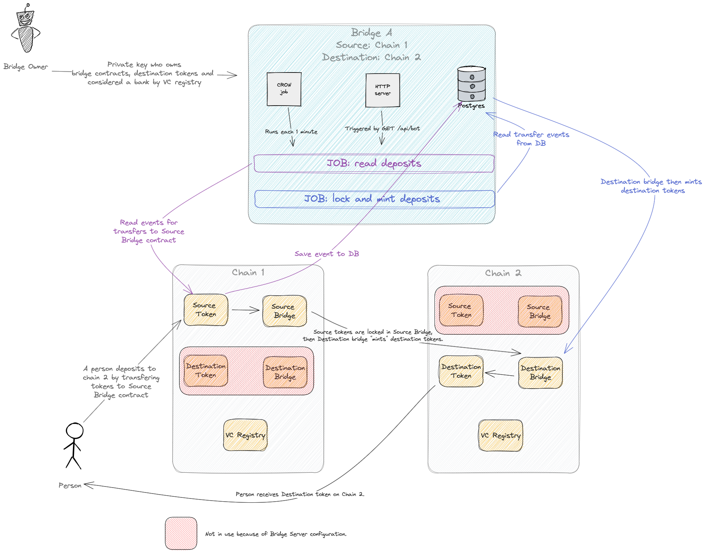
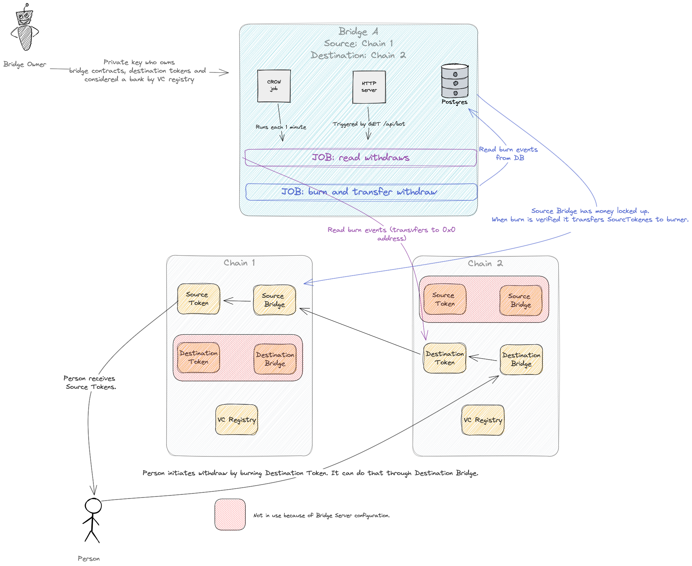

# DSP & Brreg Bridge

A "chain universal" bridge that lets you move DSP tokens from one chain to another all while respecting VC registry from source chain.

Features
- Can be used in any direction on suppported chains through configuration patterns.
- Only one transaction needed from the user to deposit and withdraw tokens.
- Sync runs each minute. Can be invoked by API.
- Created for ease of use, not security.

# Sync VC registry

# Deposit tokens

# Withdraw tokens

# FAQ

## Supported chains
- Besu
- Hardhat
- Arbitrum Göerli 
- Possible others also...